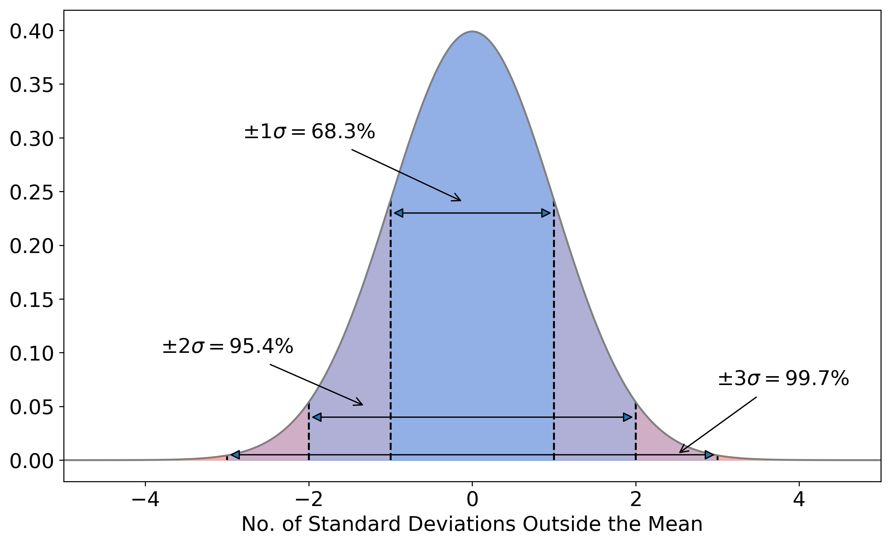

# Equations {#sec:equations}

```{css, echo=FALSE}
pre code {
  white-space: pre-wrap;
}
```

Equation syntax {#sec:add-eqs}
----------------

The syntax for equations is similar (but not identical) to LaTeX.

LaTeX code:

```markdown
\begin{equation}
\label{eqn:friedman}
	\left(\dfrac{\dot{a}}{a}\right)^2 + \dfrac{kc^2}{a^2} = \dfrac{8\pi G}{3}\rho 
\end{equation}
```

Rmd code:
```markdown
\begin{equation}
    \left(\dfrac{\dot{a}}{a}\right)^2 + \dfrac{kc^2}{a^2} = \dfrac{8\pi G}{3}\rho
(\#eq:friedman)
\end{equation}
```

\begin{equation}
    \left(\dfrac{\dot{a}}{a}\right)^2 + \dfrac{kc^2}{a^2} = \dfrac{8\pi G}{3}\rho
(\#eq:friedman)
\end{equation}

You can also use the latex
```markdown
\begin{align}
...
\end{align}
```
format for equations. If you're converting from LaTeX to markdown with pandoc it may convert equations to 
```markdown
\begin{aligned}
...
\end{aligned}
```
which also works.

:::fyi 
**LaTeX subequations and intertext**

I haven't been able to get subequations and intertext to work in bookdown. LaTeX equations of the form
```markdown
\begin{subequations}\begin{align}
\vec{E} &= \left( x,t \right)
\intertext{and in 3 dimensional space as}
\vec{E} &= \left( x,y,z,t \right)
\end{align}\end{subequations}
```

should be written as separate equations with the text between written outside the equation environment, e.g. 
```markdown
\begin{align}
\vec{E} &= \left( x,t \right)
\end{align}
and in 3 dimensional space as
\begin{align}
\vec{E} &= \left( x,y,z,t \right)
\end{align}
```
:::

Equation numbers and labels {#sec:eq-nos-labels}
------

The syntax for the maths is the same, but the labelling changes. To label and equation add

```markdown
(\#eq:label)
```
just before `end{equation}`. Only equations with labels will be numbered. If you don't want numbers then don't label the equations, but numbers are helpful.


Cross referencing equations {#sec:cross-ref-eqs}
-----

The syntax for cross-referencing equations is similar to sections and figures, i.e.

```markdown
Eqn. \@ref(eq:friedman) is the Friedman equation
```
will give "Eqn. \@ref(eq:friedman) is the Friedman equation".

Maths in captions {#sec:maths-captions}
------
R markdown gets a bit finicky about maths/symbols in captions. You may need to use two backslashes to escape symbols in figure captions. 

Example of a finicky caption:

`````markdown
```
{r echo=FALSE, gaussian, out.width='100%', fig.show='hold', fig.cap="Gaussian uncertainties. 
If we measure a value $x$ for a variable that has a true value $\\langle x \\rangle$ and
uncertainty $\\sigma$, there is a 68.3% probability that $x$ will be within 
$\\langle x \\rangle \\pm 1\\sigma$. There's a 95.4% probability of $x$ being within 
$\\langle x \\rangle \\pm 2\\sigma$, and 99.7% of $x$ being within  
$\\langle x \\rangle \\pm 3\\sigma$."}

```
`````

```{r echo=FALSE, gaussian, out.width='100%', fig.show='hold', fig.cap="Gaussian uncertainties. If we measure a value $x$ for a variable that has a true value $\\langle x \\rangle$ and uncertainty $\\sigma$, there is a 68.3% probability that $x$ will be within $\\langle x \\rangle \\pm 1\\sigma$. There's a 95.4% probability of $x$ being within $\\langle x \\rangle \\pm 2\\sigma$, and 99.7% of $x$ being within  $\\langle x \\rangle \\pm 3\\sigma$."}

```

Random tips {#sec:random-tips}
---------

**Angstrom symbol:** Use `$\unicode{x0212B}$` rather than `$\AA$` to get $\unicode{x0212B}$. You can ddd `\newcommand{\AA}{\unicode{x0212B}}` to index.Rmd file before the main text starts to make `$\AA$` work.
