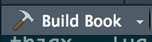

# Publishing {#sec:publishing}

## Compiling the book {#sec:create-book}

To compile the book, press the 'Build Book' button in R Studio. You may need to press the arrow on the button and select `bookdown::gitbook` the first time you do this.

```{r echo=FALSE, build-book, out.width='50%', fig.show='hold', fig.cap="Build book button"}

```

This compiles all the markdown to create html files for the book. The output files should be in the `_book` folder.

## Publishing with github pages {#sec:gh-pages}

**THIS SECTION IS NOT COMPLETE**

**Note:** There is probably a way to do this so that the files are published to somewhere on the University servers. I haven't tried. This is the way I do it.

I use [github pages](pages.github.com) to publish my notes. 

The following assumes you are already using github to store your files. **TODO: Can add instructions for this part if needed**.

Once you have your book on github, create a new branch called `gh-pages`. This should enable the gh-pages setting in the repo.

Now clone the gh-pages branch into a directory called `book-output`

```
git clone -b gh-pages $repo-path book-output
```
where `$repo-path` is the location of the repository on github, e.g. `https://github.com/your_user_name/lecture_notes.git/`

Then you want to copy all the output files into this directory and push it to the gh-pages branch.

```
cd book-output
cp -r ../_book/* ./
git add --all *
git commit -m "Update the book" || true
git push -q origin gh-pages
```

Your pretty lecture notes should now be online! You should find them at github_username.github.io/repo_name - or check the setting page of the repository. The address will be given in the github pages section.


